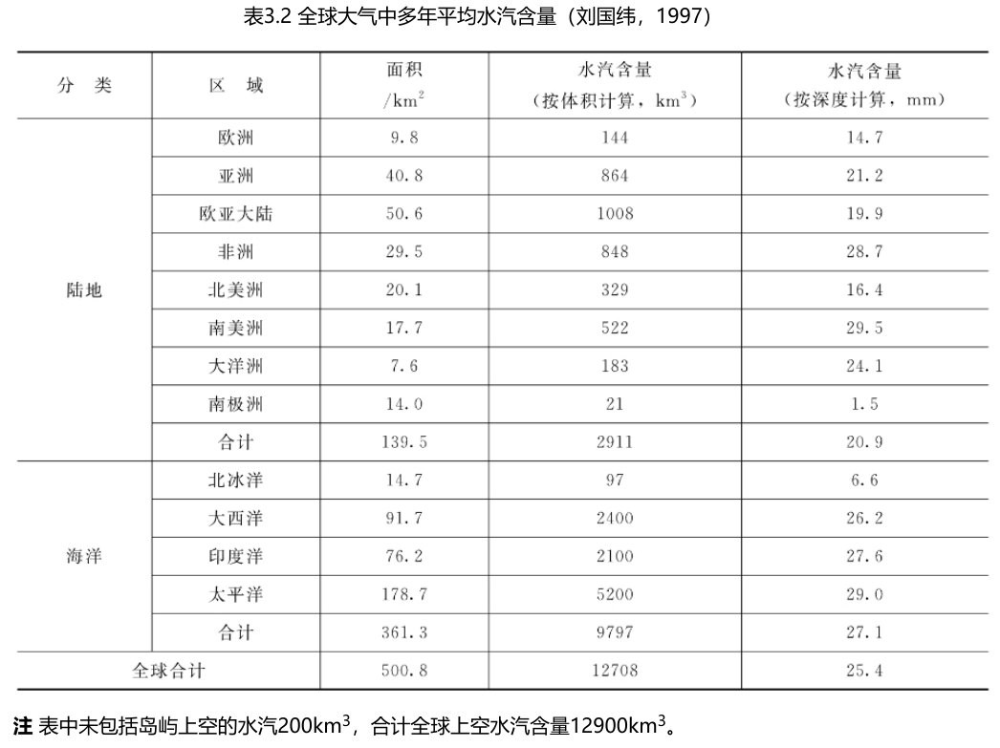
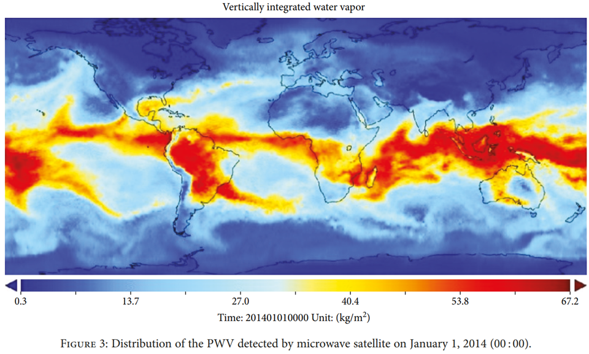

<!-- page_number: true -->

<h1>水文气象学–04水汽通量与暴雨分析</h1>

 

> 葛朝霞等，__气象学与气候学教程__，中国水利水电出版社（第2版）
>
> - 1.4. 大气静力学方程及其应用
>
> - 1.5.2 气压与气压场
> 
> - 4.1. 作用在气块上的力
>
> - 4.4. 自由大气中的风

 

孔冬冬，__kongdongdong@cug.edu.cn__

办公室：环境学院416

中国地质大学大气科学系 · 武汉

---

# 1. 大气可降水量

定义：单位面积上，整个大气柱中的水汽全部凝结，降落至地面的水量（单位$mm$）。

 

- 厚度为dz的湿空气块，其所具有的水量：

$$
\begin{align*}
dW &= \rho_v dz, (dp = - \rho g dz)\\
   &= -\frac{1}{g}\frac{\rho_v}{\rho} dp

\end{align*}
$$

- 从地面（$z=0, p=P_s$）到高空（$z=z, p=P_t$），对其水汽含量进行积分：

$$
\begin{align*}
W &= \int dW = \sum_{0}^{z} \rho_v dz \\
  &= - \sum_{P_s}^{P_t} \frac{1}{g}\frac{\rho_v}{\rho} dp =
  \frac{1}{g} \sum_{P_t}^{P_s} q dp
\end{align*}
$$

---

上述公式没有解析解，只能以离散的形式进行求解：

把大气划分为$n$个区间（$1$到$n+1$层）。

 

- 从第$i$层到第$i+1$层的水汽含量：

$$
\Delta W = \frac{1}{g} \frac{1}{2}(q_i + q_{i+1}) (p_i - p_{i+1}) \\
 =  \frac{1}{2g} (q_i + q_{i+1}) \Delta p_i
$$

- 因此整层的大气可将水量：

$$
W = \sum_{i = 1}^{i=n} \Delta W_i 
  = \frac{1}{2g}  \sum_{i = 1}^{i=n} (q_i + q_{i+1}) \Delta p_i
$$

  

---

  

---

  

---

# 2. 水汽通量

__水汽通量__：单位时间内通过某一单位面积的水汽质量，单位常用$g/s$；是水汽输送强度的物理量。

<!-- 一般来说，水汽输送是指水平方向上的水汽输送，用水平的水汽通量表示其强度。 -->

- 截面的面积(A)：$\Delta P × \Delta L$
- 通过的气体体积(V)：$\Delta P × \Delta L × v \Delta t$
- 通过的<u>水汽</u>气体质量(m_v): $m_v = m q = q \rho (\Delta P × \Delta L × v \Delta t)$

由于是单位面积、单位时间，因此$m_v$需要除以$A$和$\Delta t$，因此水汽通量:

$$
\begin{align*}
Q &= \frac{q \rho (\Delta P × \Delta L × v \Delta t)}{(\Delta P × \Delta L) \Delta t} \\
  &= qv \rho 
  % = - qv \frac{dp}{g dz} 
\end{align*}
$$

  

<!-- 单位: m/s * kg  -->

$$
p = \rho g h \\
\rho (v / t) h = p \\
\rho (v / t) = p /h \\

Pa/m
$$

---

## 整层水汽通量

$$
\begin{aligned}
&Q=\int_{z_1}^{z_2} q \rho v d z,(d p=-\rho g d z) \\
&=-\int_{p_1}^{p_2} q \rho v \frac{d p}{\rho g}
% =-\int_{p_1}^{p_2} q v \frac{d p}{g}
=-\frac{1}{g} \int_{p_1}^{p_2} q v d p
\end{aligned}
$$

- 整层水汽通量的单位：kg/(m·s)

- 某一层大气水汽输送水平通量，得出的是每单位气压差每单位长度的水汽通量，因而其单位为kg/(m·s·hPa)

---
