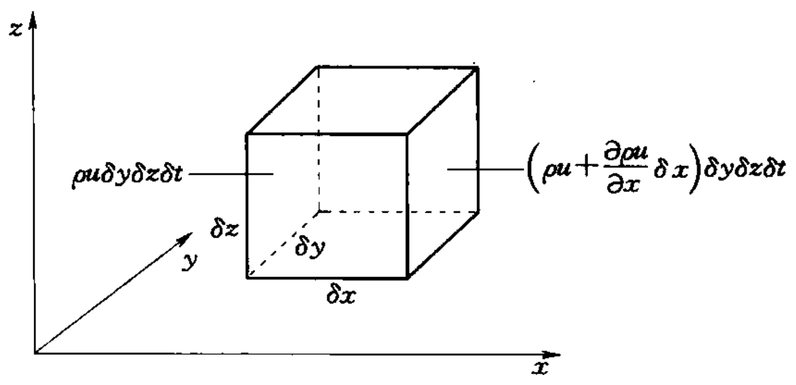
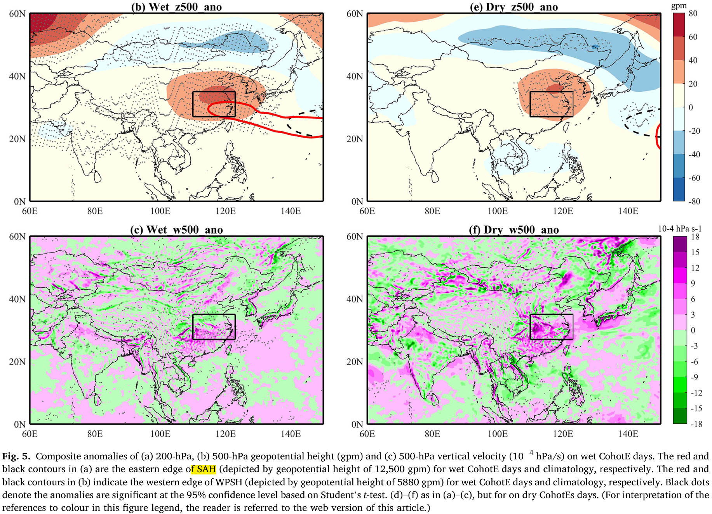
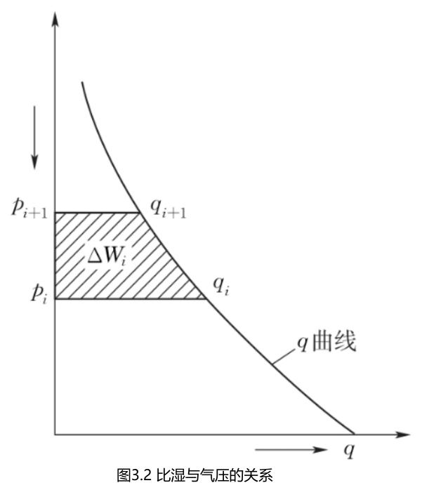
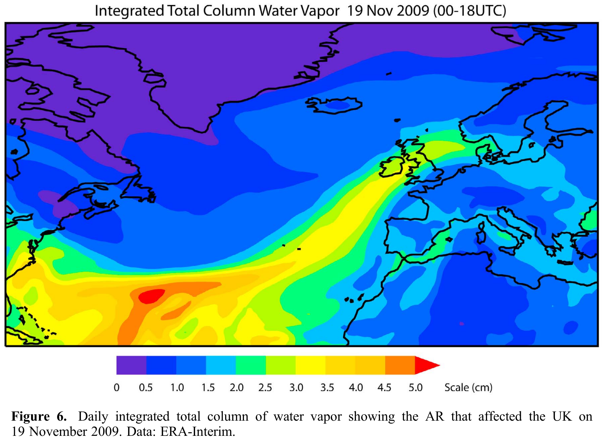
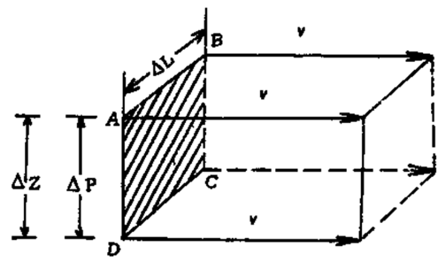
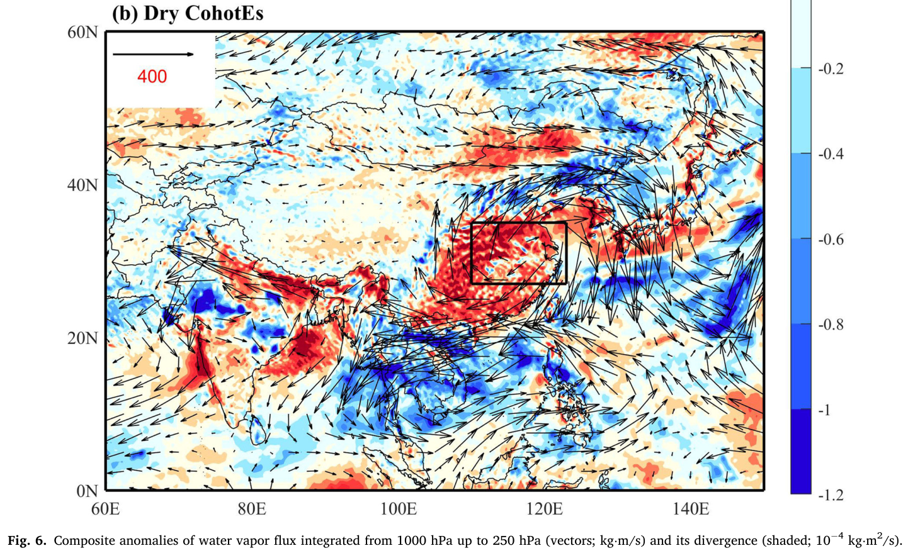

<!-- page_number: true -->

<h1>水文气象学</h1>
<h3>ch04_大气中的水汽——水汽通量与暴雨来源分析</h3>

 

> 葛朝霞等，__气象学与气候学教程__，中国水利水电出版社（第2版）
> - 4.7 水平运动与垂直运动的关系
> - 5.4 水分方程和可降水量

 

孔冬冬，__kongdongdong@cug.edu.cn__

办公室：环境学院416

中国地质大学大气科学系 · 武汉

---

<h2>QA: </h2>

> 君不见黄河之水天上来，奔流到海不复回。-- 李白

 

天上的水，从哪里来？

  

---

# 1. 水平运动与垂直运动的关系

---

## 1.1. 欧拉与拉格郎日观点

- 欧拉：着眼于空间。温度$T$随时间$t$和空间位置($x, y, z$)变化，$T = f(t, x, y, z)$，变化速率：

$$
\begin{align*}
\frac{d T}{dt} &= {\partial T  \over \partial t} +
  {\partial T  \over \partial x} {dx \over dt} +
  {\partial T  \over \partial y} {dy \over dt} +
  {\partial T  \over \partial z} {dz \over dt}   \\  
  &= {\partial T  \over \partial t} +
  {\partial T  \over \partial x} u +
  {\partial T  \over \partial y} v +
  {\partial T  \over \partial z} w \\
  &= {\partial T  \over \partial t} + V \nabla · T
\end{align*}
$$

- 拉格朗日：着眼于质元。$T$只随时间$t$变化，T = g(t)，变量速率：$\frac{dT}{dt}$

<!-- __References：__ -->

> 1.$\nabla = \frac{\partial f}{\partial x} \boldsymbol{i}  + \frac{\partial f}{\partial y} \boldsymbol{j} + \frac{\partial f}{\partial y} \boldsymbol{k}$, $\nabla_h = \frac{\partial f}{\partial x} \boldsymbol{i}  + \frac{\partial f}{\partial y} \boldsymbol{j}$
> 2.拉格朗日描述与欧拉描述，<https://www.zhihu.com/question/26129680>

<!-- 2. 连续方程的数学推导, <https://www.bilibili.com/video/BV1d64y1Q7iw> -->

---

如果是密度$\rho$，公式也是同样的形式：

> 密度随时间的变化：可联想污染物的扩散，污染物密度的变化

 

$$
\begin{align*}
\frac{d \rho}{dt} &= {\partial \rho  \over \partial t} +
  {\partial \rho  \over \partial x} {dx \over dt} +
  {\partial \rho  \over \partial y} {dy \over dt} +
  {\partial \rho  \over \partial z} {dz \over dt}   \\  
  &= {\partial \rho  \over \partial t} +
  {\partial \rho  \over \partial x} u +
  {\partial \rho  \over \partial y} v +
  {\partial \rho  \over \partial z} w \\
  &= {\partial \rho  \over \partial t} + V \nabla · \rho
\end{align*}
$$

---

## 1.2. 连续方程

  

> $x$方向净流入量：

$$
\rho u \delta y \delta z \delta t - (\rho u  + \frac{\partial \rho u}{\partial x} )\delta y \delta z \delta t =
- \frac{\partial \rho u}{\partial x} \delta y \delta z \delta t
$$

同理可以得出$y$和$z$方向的流入量，
分别为：$- \frac{\partial \rho v}{\partial y} \delta x \delta z \delta t$、$- \frac{\partial \rho w}{\partial z} \delta x \delta y \delta t$，因此，

---

$$
\frac{\partial \rho}{\partial t} \delta x \delta y \delta z \delta t =
- ({\partial \rho u \over \partial x} +
  {\partial \rho v \over \partial y} +
  {\partial \rho w \over \partial z}) \delta x \delta y \delta z \delta t \\

\frac{\partial \rho}{\partial t} + {\partial \rho u \over \partial x} +
  {\partial \rho v \over \partial y} +
  {\partial \rho w \over \partial z} = 0 \\

\frac{\partial \rho}{\partial t} + \nabla · (\rho V) = 0 \\
\frac{\partial \rho}{\partial t} + V \nabla · \rho  + \rho \nabla · V= 0
$$

---

$$
\begin{align*}
(\frac{\partial \rho}{\partial t} + V \nabla · \rho )  + \rho \nabla · V = 0 \\
\frac{d \rho}{dt} + \rho \nabla · V = 0
\end{align*}
$$

> <u>拉格朗日：对于质元（研究对象恒定），只要体积不变（不可压缩），则$\rho$不变。</u>

流体不可压缩，则其流动过程中密度不变($\frac{d \rho}{dt} = 0$)，则$\nabla · V = 0$，即

$$
{\partial u \over \partial x} +
  {\partial v \over \partial y} +
  {\partial w \over \partial z} = 0 \\

\mathbf{Div} = ({\partial u \over \partial x} +
  {\partial v \over \partial y}) = -{\partial w \over \partial z} （散度）
$$

通过上面的公式，可以看出水平运动和垂直运动之间的关系。

- 水平辐合（$\mathbf{Div} < 0$），则$w > 0$，向上运动；
  
- 水平辐散（$\mathbf{Div}> 0$），则$w > 0$，向上运动；

> 1.连续方程的数学推导, <https://www.bilibili.com/video/BV1d64y1Q7iw>

---

不可压缩气体：

- z坐标中（$t, x, y, z$）

$$
{\partial u \over \partial x} +
  {\partial v \over \partial y} +
  {\partial w \over \partial z} = 0, (w = \frac{dz}{dt})
$$

- p坐标中（$t, x, y, p$）

$$
{\partial u \over \partial x} +
  {\partial v \over \partial y} +
  {\partial \omega \over \partial p} = 0, (\omega = \frac{dp}{dt})
$$

$w$和$\omega$之间的关系：

- 向上运动：$w > 0$，$\omega < 0$，辐合，降水
- 向下运动：$w < 0$，$\omega > 0$，辐散，高温干旱

---

<h4>热浪分析中的应用：</h4>

$\omega = \frac{dp}{dt}$

<!-- $w$和$\omega$之间的关系： -->

- 向上运动：$w > 0$，$\omega < 0$，辐合，降水
- 向下运动：$w < 0$，$\omega > 0$，辐散，高温干旱

  

---

# 2. 大气中的水汽

---

## 2.1. 大气可降水量

定义：单位面积上，整个大气柱中的水汽全部凝结，降落至地面的水量（单位$mm$）。

英文：`Precipitable Water Vapor`, `Vertical Integrated Water Vapor`

 

- 单位面积($A=1m^2$)，厚度为dz的湿空气块，其所具有的水量：

$$
\begin{align*}
dW &= \rho_v A dz, (dp = - \rho g dz)\\
   &= -\frac{1}{g}\frac{\rho_v}{\rho} dp = -\frac{1}{g} q dp

\end{align*}
$$

- 从地面（$z=0, p=P_s$）到高空（$z=z, p=P_t$），对其水汽含量进行积分：

$$
\begin{align*}
W &= \int_{P_s}^{P_t} dW = -\frac{1}{g} \int_{P_s}^{P_t} q dp  \\
  % &= \frac{1}{g} \sum_{P_t}^{P_s} q dp
\end{align*}
$$

---

上述公式没有解析解，只能以离散的形式进行求解：

把大气划分为$n$个区间（$1$到$n+1$层）。

> Recall: $S = \int{f(x) dx}$的求解方法

 

- 从第$i$层到第$i+1$层的水汽含量：

$$
\Delta W_i = \frac{1}{g} \frac{1}{2}(q_i + q_{i+1}) (p_i - p_{i+1}) \\
 =  \frac{1}{2g} (q_i + q_{i+1}) \Delta p_i
$$

- 因此整层的大气可将水量：

$$
W = \sum_{i = 1}^{i=n} \Delta W_i 
  = \frac{1}{2g}  \sum_{i = 1}^{i=n} (q_i + q_{i+1}) \Delta p_i
$$

  

---

  

---

  

---

大气可降水量 -> 潜在的大气河流

 

<u>Gimeno, et al., 2012, Reviews of Geophysics</u>

  

<!-- Gimeno, L., Stohl, A., Trigo, R. M., Dominguez, F., Yoshimura, K., Yu, L., et al. (2012). Oceanic and terrestrial sources of continental precipitation. Reviews of Geophysics, 50(4), RG4003. <https://doi.org/10.1029/2012RG000389> -->

---

## 2.2. 单层水汽通量

**定义**：单位时间、单位面积，通过的水汽质量。

**单位**：$kg~m^{-2}s^{-1}$

<!-- 一般来说，水汽输送是指水平方向上的水汽输送，用水平的水汽通量表示其强度。 -->

- 通过的气体体积(V)：($\Delta P × \Delta L) × v \Delta t$
- 通过的<u>水汽</u>气体质量($m_v$): $m_v = m q = q \rho (\Delta P × \Delta L × v \Delta t)$

由于是单位面积、单位时间，因此$m_v$需要除以$A$和$\Delta t$，因此水汽通量:

$$
\begin{align*}
f &= \frac{q \rho (\Delta P × \Delta L × v \Delta t)}{(\Delta P × \Delta L) \Delta t} = q \rho v
  % = - qv \frac{dp}{g dz} 
\end{align*}
$$

可以根据$q v \rho$进一步验证$f$的单位：$kg~m^{-2}s^{-1}$，:grinning:。

  

<!-- 单位: m/s * kg  -->

$$
% p = \rho g h \\
% \rho (v / t) h = p \\
% \rho (v / t) = p /h \\
% Pa/m
$$

---

## 2.3. 整层水汽通量

**定义**：单位时间、单位宽度，通过整层气柱的水汽质量，单位$kg~m^{-1}s^{-1}$。

**单位**：kg/(m·s)

$$
\begin{aligned}
&F=\int_{z_s}^{z_t} q \rho v d z,(d p=-\rho g d z) \\
&=-\int_{p_s}^{p_t} q \rho v \frac{d p}{\rho g}
% =-\int_{p_s}^{p_t} q v \frac{d p}{g}
=-\frac{1}{g} \int_{p_s}^{p_t} q v d p
\end{aligned}
$$

> 与大气可降水量相比，整层水汽通量多乘了速度$v$。

---

## 2.4. 水汽通量散度

1. **水汽通量**

$$
\begin{align*}
f &= q \rho v \\
F &= -\frac{1}{g} \int_{p_s}^{p_t} q v d p \\
\end{align*}
$$

2. **水汽通量散度**

$$
\begin{align*}
d &= \nabla_h (q \rho v) \\
\mathbf{Div} &= -\int_{p_s}^{p_t} \nabla_h(q \rho v) \frac{d p}{\rho g}
\\
  &= -\frac{1}{g} \int_{p_s}^{p_t} \nabla_h(q v) d p

\end{align*}
$$

<!-- $$
\begin{align*}
% \nabla &= \frac{\partial f}{\partial x} \boldsymbol{i}  + \frac{\partial f}{\partial y} \boldsymbol{j} + \frac{\partial f}{\partial z} \boldsymbol{k} \\

\nabla_h &= \frac{\partial f}{\partial x} \boldsymbol{i}  + \frac{\partial f}{\partial y} \boldsymbol{j}

\end{align*}
$$ -->

---

2. **水汽通量散度**

$$
\begin{align*}
d &= \nabla_h (q \rho v) \\
\mathbf{Div} &= -\frac{1}{g} \int_{p_s}^{p_t} \nabla_h(q v) d p
\end{align*}
$$

- $\mathbf{Div} < 0$，进多出少（<u>**降水**</u>），辐合，气柱的水汽增加+ :

- $\mathbf{Div} > 0$，进少出多（<u>__蒸发__</u>），辐散，气柱的水汽流失-

> $\mathbf{Div}$可以类比径流。

---

<u>Ma, 2022, GPC.</u>

---

## 2.5. 大气水量平衡

较难观测变量：$E$、$\Delta S$、$\Delta W$

- 地表水量平衡：

$$
\Delta S = P - E - R + RES_s
$$
- 大气水汽平衡，降水水分丢失，蒸发水分补充

$$
\Delta W = -\mathbf{Div} - P + E + RES_w
$$

> 其中$RES_s$为storage的残差项，如人类用水活动（生活、工业、农业、水利工程），以及模型的模拟误差；$RES_w$为vapor中的残差项，

两式相加可以得到：

$$
- R - \mathbf{Div} = \Delta W + \Delta S
$$

> 上式提供了验证$E$的另一个思路。**How？**

---

1. 多年尺度，可以认为$\Delta S = 0$，$\Delta W = 0$，因此$\overline R = - \overline{\mathbf{Div}}$

   > 可以根据径流资料，判断哪个再分析资料的$\mathbf{Div}$质量比较好；

2. 根据水汽平衡，得出$E_{wb}$

$$
\Delta W = -\mathbf{Div} - P + E + RES_w
$$

3. $E_{wb}$作为观测值，评估$E$模拟好坏

---

<h3>参考文献：</h3>

1. Ma, F., Yuan, X., & Li, H. (2022). Characteristics and circulation patterns for wet and dry compound day-night heat waves in mid-eastern China. ***Global and Planetary Change***, 213, 103839.

2. Roads, J., Kanamitsu, M., & Stewart, R. (2002). CSE Water and Energy Budgets in the NCEP–DOE Reanalysis II. ***Journal of Hydrometeorology***, 3(3), 227–248.

3. Lorenz, C., & Kunstmann, H. (2012). The Hydrological Cycle in Three State-of-the-Art Reanalyses: Intercomparison and Performance Analysis. ***Journal of Hydrometeorology***, 13(5), 1397–1420.

4. 丁一汇, 柳艳菊, & 宋亚芳. (2020). 东亚夏季风水汽输送带及其对中国大暴雨与洪涝灾害的影响. ***水科学进展***, 31(5), 629–643.
