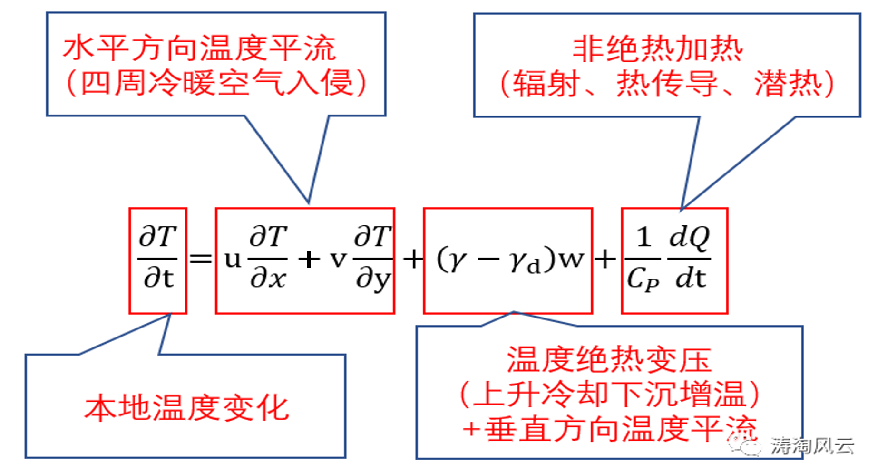

<!-- page_number: true -->

<h1>水文气象学</h1>
<h2>热浪研究方法</h2>

> 葛朝霞等，__气象学与气候学教程__，中国水利水电出版社（第2版）
>
> - 3.7 局地温度变化

 

孔冬冬，__kongdongdong@cug.edu.cn__

办公室：环境学院416

中国地质大学大气科学系 · 武汉

---

## 1. 热流量方程

根据热力学第一定律：

$$
\frac{\mathrm{d} Q}{\mathrm{~d} t}=c_p \frac{\mathrm{d} T}{\mathrm{~d} t}-\frac{R T}{p} \frac{\mathrm{d} p}{\mathrm{~d} t} ~~~(Eq. 3.3)
$$

温度和压力的变化：

$$
\begin{aligned}
\frac{\mathrm{d} T}{\mathrm{~d} t} & =\frac{\partial T}{\partial t}+\boldsymbol{V} \cdot \nabla_h T+w \frac{\partial T}{\partial z} \\
\end{aligned}
$$

$$
\begin{aligned}
\frac{\mathrm{d} p}{\mathrm{~d} t} & =\frac{\partial p}{\partial t}+\boldsymbol{V} \cdot \nabla_h p+w \frac{\partial p}{\partial z} \\
& \approx -\rho g w=-\frac{g p}{R T} w
\end{aligned}
$$

把后面两个公式，带入热力学公式，整理可得：

$$
\frac{\partial T}{\partial t} 
  = -V \cdot \nabla_h T + (\frac{\partial T}{\partial Z} - \frac{g}{c_p}) w+\frac{1}{c_p} \frac{\mathrm{d} Q}{\mathrm{~d} t} \\
  = -V \cdot \nabla_h T+(\gamma - \gamma_d) w+\frac{1}{c_p} \frac{\mathrm{d} Q}{\mathrm{~d} t}
$$

---

  

---

## 2. 热浪的影响因素

> 热浪：指的是持续一定时间的气温或体感温度异常偏高的异常时间。

<h4>直接影响因素：</h4>

- 气温
- 比湿

<h4>间接影响因素：</h4>

- 高低压中心
- 风场
- 温度平流
- 垂直速度
- 水汽输送

---

## 3. 用到的理论

---

### 3.1. 位势高度的作用

1. 气压高低
    > <u>*位势高度*</u>高（低）意味着同一平面上该点的气压也偏高（低）

2. 大气层平均虚温；
    > 根据压高公式，<u>*位势高度厚度*</u>与虚温$T_v$正相关

3. 风向（平行于等高线）；
    > 气压梯度力和科氏力的影响下，风向平行于<u>*等位势高度线*</u>；摩擦力影响下，逆时针偏转15°~30°

4. 环流形式与天气系统
    > 环流形式，如高低压系统（气旋、反气旋）、槽脊（槽前脊后阴雨）；
    > 天气系统，如副高、南亚高压、阻塞高压、切断低压、冷涡

5. 辐合辐散

---

### 3.2. 辐射与温度

$$
Rn = (1 - a) Rs + \epsilon (Rl_{in} - \sigma T^4) \\
Rn - G = LE + H
$$

### 3.3. 水汽输送

- 水汽输送：水汽含量、水汽通量、水汽散度

- 水平运动与垂直运动的关系：下沉辐散、增温

---

## 4. 实战与案例分析
